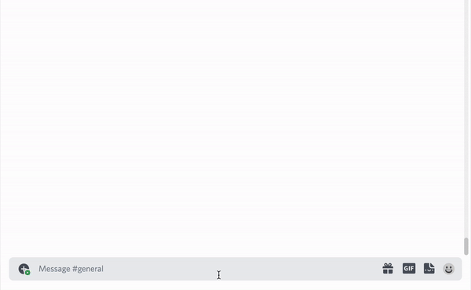

> **In `dev_guild` mode, the command name is automatically converted to `dev_(name)`.**

> **Do not include `dev_` in the `command file` or `command name`.**
>
> The corresponding indication is required for testing in `dev_guild`.

# Command template

> [**Button**](#button)
>
> [**Select Menu**](#select-menu)
>
> [**Context Menu**](#context-menu)

```ts
import { MessageComponentInteraction } from 'discord.js';

export default {
    process: (interaction: MessageComponentInteraction) => {
        // Do something
    },
    command: new SlashCommandBuilder()
        .setName('command')
        .setDescription('Command description'),
};
```

---

# Button


```ts
import { SlashCommandBuilder } from '@discordjs/builders';
import {
    MessageActionRow,
    MessageButton,
    MessageComponentInteraction,
} from 'discord.js';
import { v4 as uuid } from 'uuid';

export default {
    process: (interaction: MessageComponentInteraction) => {
        const _id = uuid();
        interaction.reply({
            content: `${_id}`,
            components: [
                new MessageActionRow().addComponents(
                    new MessageButton()
                        .setCustomId(_id)
                        .setLabel('Click here!')
                        .setStyle('PRIMARY')
                ),
            ],
        });

        const collector = interaction.channel?.createMessageComponentCollector({
            filter: (m) =>
                m.user.id === interaction.user.id && m.customId === _id,
            // max: 1,
        });
        collector?.on('collect', (i) => {
            i.reply({
                content: 'Button clicked.',
                ephemeral: true,
            });
        });
    },
    command: new SlashCommandBuilder()
        .setName('button')
        .setDescription('Button message component'),
};
```

# Select Menu


```ts
import { SlashCommandBuilder } from '@discordjs/builders';
import {
    MessageActionRow,
    MessageComponentInteraction,
    MessageSelectMenu,
    SelectMenuInteraction,
} from 'discord.js';
import { v4 as uuid } from 'uuid';

export default {
    process: (interaction: MessageComponentInteraction) => {
        const _id_select = uuid();
        interaction.reply({
            content: `Select an item`,
            components: [
                new MessageActionRow().addComponents(
                    new MessageSelectMenu()
                        .setCustomId(_id_select)
                        .setPlaceholder('Select an item')
                        .setMinValues(1)
                        .setMaxValues(2)
                        .addOptions([
                            {
                                label: 'item 1',
                                description: 'description 1',
                                value: 'item 1',
                            },
                            {
                                label: 'item 2',
                                description: 'description 2',
                                value: 'item 2',
                            },
                            {
                                label: 'item 3',
                                description: 'description 3',
                                value: 'item 3',
                            },
                        ])
                ),
            ],
        });

        const collector = interaction.channel?.createMessageComponentCollector({
            filter: (m) =>
                m.user.id === interaction.user.id && m.customId === _id_select,
            // max: 1,
        });

        collector?.on('collect', (i) => {
            i.reply({
                content: `Selected ${(i as SelectMenuInteraction).values
                    .map((v) => `\`${v}\``)
                    .join(', ')}.`,
                ephemeral: true,
            });
        });
    },
    command: new SlashCommandBuilder()
        .setName('menu')
        .setDescription('Select Menu message component'),
};
```

# Context Menu



```ts
import { ContextMenuCommandBuilder } from '@discordjs/builders';
import { ContextMenuInteraction } from 'discord.js';

export default {
    process: (interaction: ContextMenuInteraction) => {
        interaction.reply({
            content: `${interaction.options.data[0].message?.content}`,
            ephemeral: true,
        });
    },
    command: new ContextMenuCommandBuilder().setName('menu').setType(3),
};
```
