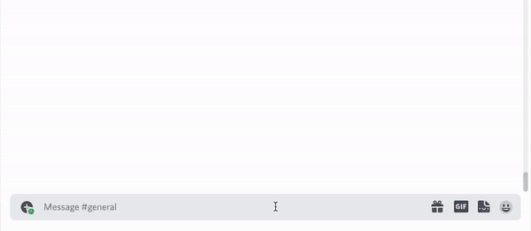
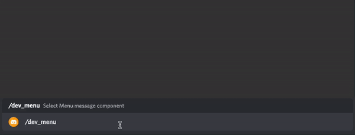

> **Command file name and, command name must match.**

> **In `dev_guild` mode, the command name is automatically converted to `dev_(name)`.**

> **Do not include `dev_` in the `command file` or `command name`.**
>
> The corresponding indication is required for testing in `dev_guild`.

# Command template

> [**Button**](#button)
>
> [**Select Menu**](#select-menu)
>
> [**Context Menu**](#context-menu)

```ts
import { MessageComponentInteraction } from 'discord.js';

export default {
    process: (interaction: MessageComponentInteraction) => {
        // Do something
    },
    command: new SlashCommandBuilder()
        .setName('command')
        .setDescription('Command description'),
};
```

---

# Button



> **Source code**: [button.ts](./button.ts)

<br>

# Select Menu



<br>

> **Source code**: [select_menu.ts](./select_menu.ts)

# Context Menu

> **Source code**: [context_menu.ts](./context_menu.ts)
