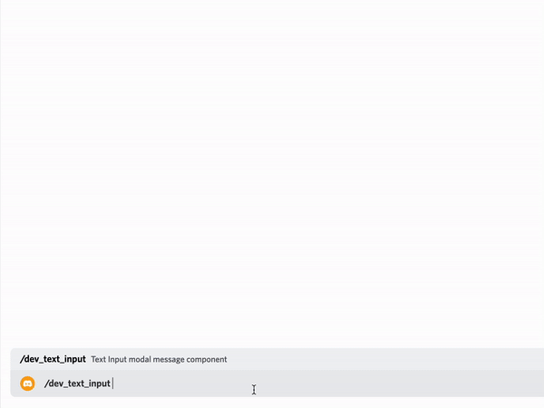
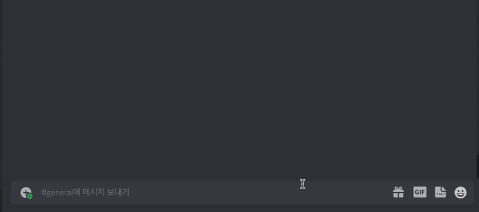

**EN | [KO](README_kr.md)**

<br>

> **Command file name and, command name must match.**

> [`index.ts#L11`](https://github.com/tsukiroku/discord-interaction-template/blob/main/index.ts#L11)

# Command template

## [**Button**](./examples/button.ts)


<br />

## [**Select Menu**](./examples/select_menu.ts)


<br />

## [**Context Menu**](./examples/context_menu.ts)


<br />

## [**Text Input (Modal)**](./examples/text_input.ts)



<br />

## [**Simple regex game (feat. `createMessageCollector` Example)**](./examples/regex.ts)



<br />

```ts
import { Types } from '../utils'

export default {
    process: (interaction: Types.IMessageComponent) => {
        interaction.reply({
            content: 'Hello, world!',
            ephemeral: true,
        })
    },
    command: null,
}
```
